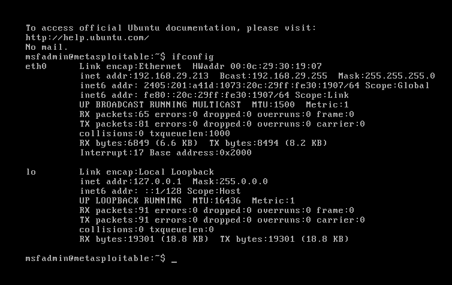
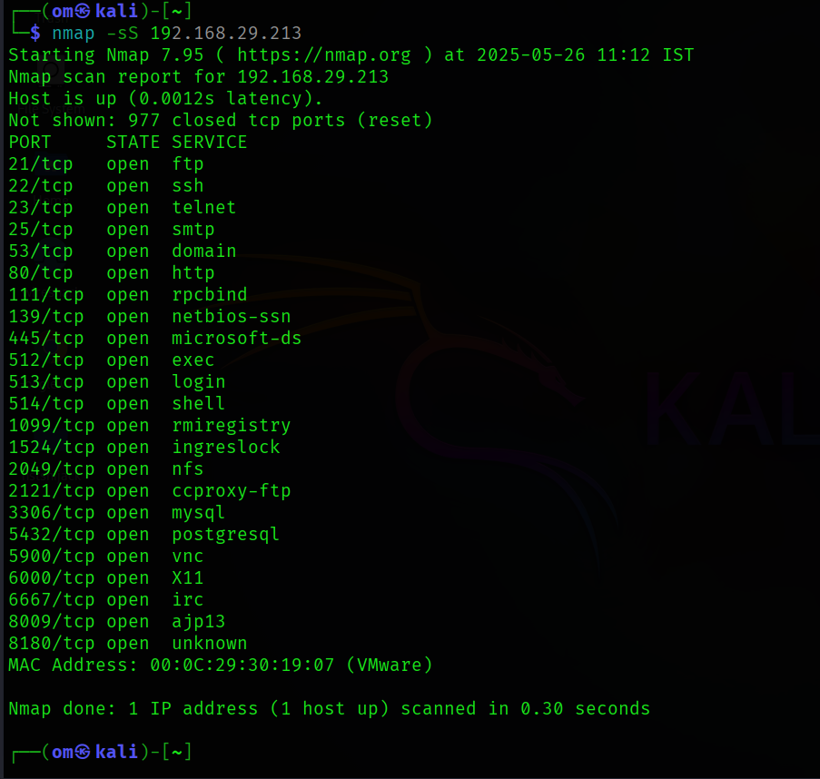
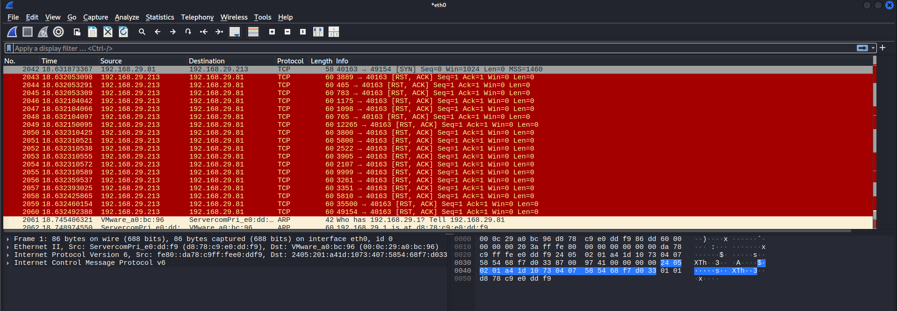

# network-port-scan-task1
Task 1: Local Network Port Scanning using Nmap


# Task 1: Local Network Port Scanning using Nmap

##  Objective:
To identify open ports in the local network using Nmap and understand network exposure points.

##  Tools Used:
- Nmap (Network Mapper)
- Wireshark (for packet analysis)
- ifconfig (to identify local IP range)

##  Methodology:

1. Checked local IP address using `ifconfig` on Metasploitable machine.
   - Local IP: `192.168.29.213`
   - Interface: `eth0`

2. Performed a TCP SYN (stealth) scan from Kali machine to Metasploitable using:
   ```bash
   nmap -sS 192.168.29.213
   ```

3. Captured packets using **Wireshark** to monitor TCP SYN, SYN-ACK, and RST responses.

4. Identified open ports from Nmap results and documented the findings.

---

## 🔓 Open Ports Identified on 192.168.29.213:

| Port  | Service        |
|-------|----------------|
| 21    | FTP            |
| 22    | SSH            |
| 23    | Telnet         |
| 25    | SMTP           |
| 53    | Domain         |
| 80    | HTTP           |
| 111   | RPCBind        |
| 139   | NetBIOS-SSN    |
| 445   | Microsoft-DS   |
| 512   | exec           |
| 513   | login          |
| 514   | shell          |
| 1099  | RMI Registry   |
| 1524  | ingreslock     |
| 2049  | NFS            |
| 2121  | CCPROXY-FTP    |
| 3306  | MySQL          |
| 5432  | PostgreSQL     |
| 5900  | VNC            |
| 6000  | X11            |
| 6667  | IRC            |
| 8009  | AJP13          |
| 8180  | Unknown        |

These open ports expose several vulnerable services often used in penetration testing labs.

---

##  Screenshots

- **1. Local IP identification using ifconfig**  
  

- **2. Nmap TCP SYN scan result**  
  

- **3. Wireshark packet capture of the scan**  
  

---

##  Security Insights:

- Numerous open ports and legacy services (e.g., Telnet, FTP, RMI) expose the target to severe security risks.
- Port hardening and service auditing are critical to prevent unauthorized access.

---

##  Outcome:

- Understood how to scan a target system on a local network.
- Identified real-time open ports and verified packet flow using Wireshark.
- Learned practical reconnaissance techniques in a controlled lab environment.
